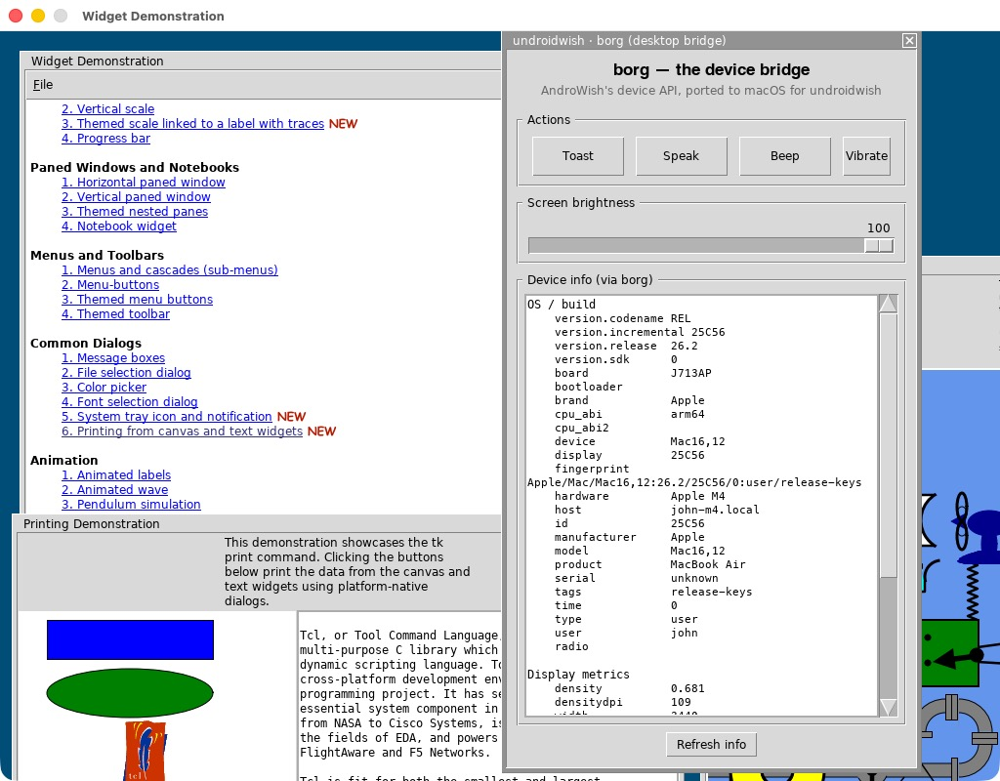

# undroidwish-arm64-batteries-included

Build [AndroWish](https://www.androwish.org/)'s **undroidwish** — the
batteries-included, single-file SDL2 `wish` — as a **native Apple-Silicon
(arm64)** macOS binary, instead of the stock x86-64 build that runs under
Rosetta.

This repo is a **recipe**: a small set of patches plus documentation. It does
**not** redistribute the AndroWish source (which has its own licenses); you
clone AndroWish, apply these patches, and run its build script.

The result is a self-contained `wish` with ~60 statically-linked Tcl/Tk
extensions (Img, tls, tdom, BLT, tkpath, itk, tktreectrl, snack, mpexpr, …),
running natively on arm64. Verified: native `tclsh8.6`/`wish` report `arm64`,
and the Tcl regression suite passes (46090 tests, 1 environment-only failure).

See [`CHANGES.md`](CHANGES.md) for a detailed, rationale-by-rationale account of
everything that had to change from stock undroidwish.

## Talk & slides

The EuroTcl 2026 talk on this port — *undroidwish for Apple Silicon Macs* —
covers why the native arm64 build matters (Apple is retiring Rosetta 2 after
macOS 27), benchmarks arm64 vs x86-under-Rosetta on an M4 MacBook Air (~1.5× on
compute, 1.25× on cold startup), the reintroduced `borg` and `ble` commands, and
the File → Demos console menu. The full deck (13 slides):

- [`presentation/undroidwish-apple-silicon.pdf`](presentation/undroidwish-apple-silicon.pdf) — PDF (renders in the browser on GitHub)
- [`presentation/undroidwish-apple-silicon.pptx`](presentation/undroidwish-apple-silicon.pptx) — PowerPoint source

## Why it's needed

**Apple is retiring Rosetta 2.** At WWDC 2025 Apple said Rosetta would stay only
"for the next two major macOS releases — through macOS 27"; macOS 26.4 (Feb 2026)
already pops a warning when you launch an Intel-only app, and macOS 28 (expected
fall 2027) removes it. A stock x86-64 undroidwish runs on Apple Silicon **only**
through that translation layer — so once Rosetta is gone, so is the stock build.
A native arm64 binary is how AndroWish/Tk apps (e.g. [de1app](https://github.com/decentespresso/de1app))
keep running on the Mac.

Going native is also just faster — there's no translation overhead:



*undroidwish arm64 running the Tk widget demo next to the reintroduced `borg`
desktop bridge — `borg osbuildinfo` reports the real Apple values
(`manufacturer Apple`, `model Mac16,12`, `cpu_abi arm64`).*

### Benchmarks — arm64 native vs x86 under Rosetta 2

Median of 5 runs on an M4 MacBook Air (macOS 26). Higher is better:

| workload | speed-up (geometric mean) |
|---|---|
| Startup (launch → ready) | **1.25×** (20% faster) |
| Math (int / float / trig / fib) | **1.47×** (~47% faster) |
| General Tcl (string / list / dict / regexp / array / binary) | **1.53×** (~53% faster) |
| Tk (widgets / canvas / text) | **1.31×** (~31% faster) |
| **Overall micro-benchmarks** | **1.46×** (~46% faster) |

So dropping Rosetta buys roughly **1.5× on compute** and **1.25× on cold
startup** — on top of surviving the macOS 27/28 cutoff.

<details>
<summary>Full per-metric results (ms, median of 5)</summary>

| metric | x86 ms | arm64 ms | faster |
|---|---:|---:|---:|
| startup (launch → ready) | 531.7 | 425.0 | 1.25× |
| math.int | 954.1 | 583.4 | 1.64× |
| math.float | 894.7 | 623.0 | 1.44× |
| math.trig | 519.7 | 336.4 | 1.54× |
| math.fib_recursion | 422.6 | 281.4 | 1.50× |
| math.bignum | 44.6 | 34.9 | 1.28× |
| str.append | 47.4 | 28.9 | 1.64× |
| str.map_regsub | 320.2 | 260.0 | 1.23× |
| str.format | 284.0 | 184.1 | 1.54× |
| list.build_sort | 137.7 | 83.1 | 1.66× |
| list.foreach_search | 125.3 | 59.2 | 2.12× |
| dict.set_get | 396.5 | 265.7 | 1.49× |
| regexp.match | 1258.9 | 982.5 | 1.28× |
| array.set_get | 157.7 | 110.0 | 1.43× |
| binary.format_scan | 167.7 | 109.1 | 1.54× |
| tk.widget_create | 20.6 | 15.5 | 1.33× |
| tk.canvas_items | 12.0 | 9.5 | 1.26× |
| tk.canvas_redraw | 124.3 | 95.4 | 1.30× |
| tk.text_insert | 4.3 | 3.2 | 1.34× |

Two caveats: the two builds also differ by a Tcl minor bump (8.6.9 → 8.6.10), so
this is a real-world build-to-build comparison, not pure arch isolation; and the
Tk gains are the smallest because much of that work is SDL surface blitting on
the GPU (instruction-set translation doesn't touch it), so CPU-heavy math and
list work shows the biggest native win.
</details>

### What's hard about the arm64 build

Building undroidwish for arm64 surfaces a chain of issues, the central one being
that AndroWish's SDL2 `configure` treats the Apple-Silicon Mac (host triple
`arm64-apple-darwin…`) as **iOS** — enabling UIKit/OpenGL ES and disabling
Cocoa — because its iOS branch label `arm*-apple-darwin*` swallows arm64 Macs.
The rest are modern-clang strictness, ancient-autoconf probes, x86-only SIMD
paths, and a couple of bundled-library codec gaps. All are documented and
patched here.

## Prerequisites

- Apple Silicon Mac, macOS 11+ (developed on macOS 26 / M4).
- **Xcode command-line tools** (clang, `swiftc`).
- **MacPorts** (`/opt/local`) for `autoconf`, `automake`, `pkg-config`, `cmake`.
- **VLC.app** (arm64) if you want the `tkvlc`/VLC bits (the build's `ADD_RPATH`
  points at it).
- An **AndroWish source checkout** (the build's baseline).
- *(Optional, for the extra extensions in `E` below)* **Homebrew (arm64)** and:
  ```
  brew install augeas taglib librdkafka libusb r
  ```

## Build

```sh
# 1. Get AndroWish (its repo / fossil mirror) — call its root $AW
#    https://www.androwish.org/  (fossil) or a git mirror.

# 2. Apply the patches from this repo to $AW:
cd "$AW"
/path/to/undroidwish-arm64-batteries-included/apply-patches.sh "$AW"

# 3. Build out-of-tree (the script refuses to run inside the AndroWish tree):
mkdir -p ~/build-uw-arm64 && cd ~/build-uw-arm64
bash "$AW/undroid/build-undroidwish-macosx.sh" init     # copy sources

# 4. Scrub stale artifacts the init may have carried in (see CHANGES F2):
find . -name '*.o' -delete
find . -name '*.a' ! -path '*win32*' ! -path '*win64*' -delete
# delete every libtool .lo whose backing object is gone, and any config.cache:
find . -name 'config.cache' -delete

# 5. Build:
bash "$AW/undroid/build-undroidwish-macosx.sh" build
```

You'll get `undroidwish` (the single-file binary), `undroidwish.app`, and
`undroidwish.dmg` in the build directory.

### Install as `undroidwish-arm64`

To keep it side-by-side with an x86 `undroidwish`:

```sh
APP=/Applications/undroidwish-arm64.app
mkdir -p "$APP/Contents/MacOS" "$APP/Contents/Resources"
# the single-file binary = the wish + appended assets.zip the build produced:
cp -p undroidwish "$APP/Contents/MacOS/undroidwish-arm64"
# arm64 requires a signature (ad-hoc is fine for local use):
codesign --force --sign - "$APP/Contents/MacOS/undroidwish-arm64"
ln -sf "$APP/Contents/MacOS/undroidwish-arm64" /usr/local/bin/undroidwish-arm64
```

### Optional extensions needing Homebrew libs

After `brew install …` (above), the four loadable extras (augeas, Rtcl,
kafkatcl, tcluvc) need their per-component configure pointed at Homebrew and the
final binary needs `/opt/homebrew/lib` on its rpath — see
[`CHANGES.md` §E](CHANGES.md). `tcltaglib` compiles but does not load.

## The patches

| patch | what |
|-------|------|
| `patches/00-build-undroidwish-macosx.patch` | toolchain: arm64 min version, clang-21 flag relaxations, autoconf cache seed, real-grep PATH, curl `--without-zstd`, SDL2 `--disable-video-opengles`, jpeg-turbo `--without-simd` |
| `patches/01-sdl2-configure-arm64-macos.patch` | **the core fix**: arm64 Mac hits the macOS/Cocoa branch, not iOS; relax `declaration-after-statement` |
| `patches/02-tkimg-libpng-disable-neon.patch` | force `PNG_ARM_NEON_OPT 0` (undefined NEON symbol) |
| `patches/03-tkimg-libtiff-disable-codecs.patch` | disable uncompiled PixarLog/ZIP TIFF codecs (in the tracked `*.h.in` templates) |
| `patches/04-sdl2tk-powerinfo-iokit.patch` | `sdltk powerinfo` via IOKit (real battery, 100 on AC/no-battery) |
| `patches/05-borg-osx-tkBorgOSX.c.patch` | **new file** `jni/src/tkBorgOSX.c` — a desktop `borg` command for macOS (see [`BORG-OSX.md`](BORG-OSX.md)) |
| `patches/06-borg-osx-build-undroidwish-macosx.patch` | build + bundle the `Borg` package into `assets.zip` |
| `patches/08-sdl2tk-fullsync-dirty-rect.patch` | skip the per-present full-surface texture upload except after expose / full redraw (gate it on a new `SDLTKX_FULLSYNC` flag set in `SdlTkScreenRefresh`); steady-state frames upload only the dirty rects |
| `patches/09-undroidwish-extras-tkzipmain-boot.patch` | auto-source a root `main.tcl` from the embedded zip on a bare launch (in `tkZipMain.c`'s interactive branch); see [`UNDROIDWISH-EXTRAS.md`](UNDROIDWISH-EXTRAS.md) |
| `patches/10-undroidwish-extras-build-script.patch` | bundle `undroidwish-extras/` (borg/BLE demos, the `ble` package, boot `main.tcl`, borgdemo/bledemo shortcuts) into `assets.zip`; add a lowercase `borg` pkgIndex alias |

Apply with `apply-patches.sh`, or individually with `git apply` / `patch -p1`
from the AndroWish root.

## The desktop `borg` command (macOS)

Stock undroidwish is *"AndroWish sans the borg"* — the Android `borg` command
(`jni/src/tkBorg.c`, a JNI bridge) is not compiled in, so code written for
AndroWish that calls `borg …` fails with *invalid command name "borg"*.

Patches 05/06 add **`jni/src/tkBorgOSX.c`**, a self-contained macOS
implementation built as a loadable Tcl stubs package (`package require Borg`),
bundled into `assets.zip`. Its subcommand surface matches the documented
Android command exactly; every documented subcommand exists and **never errors
on a well-formed call**. Where a macOS facility maps it does the real thing
(`say`, `open`, IOKit, CoreGraphics, a typed prefs store); where there is no
analog (NFC, telephony, Android content providers/intents) it is a safe no-op
returning the Android-shaped empty value. Full per-command status is in
[`BORG-OSX.md`](BORG-OSX.md).

## Demos menu in the console

Launched bare — double-clicked, or `undroidwish` with no script — the arm64
build adds a **File → Demos** submenu to the Tk console. It gathers a small
`borg` bridge demo and a Bluetooth-LE debugger alongside the bundled AndroWish
demos (widget tour, tkcon, tkinspect, tksqlite, …); entries whose package isn't
bundled are greyed out. Launching with a script (`undroidwish <script>`) is
unaffected — the menu only appears on a bare console launch.

## License

The patches, scripts, and documentation in this repository are licensed under
the **Tcl/Tk license** (a BSD-style license; see [`LICENSE`](LICENSE)). They are
modifications to / instructions for the AndroWish project; **AndroWish and the
third-party libraries it bundles retain their own original licenses.**
